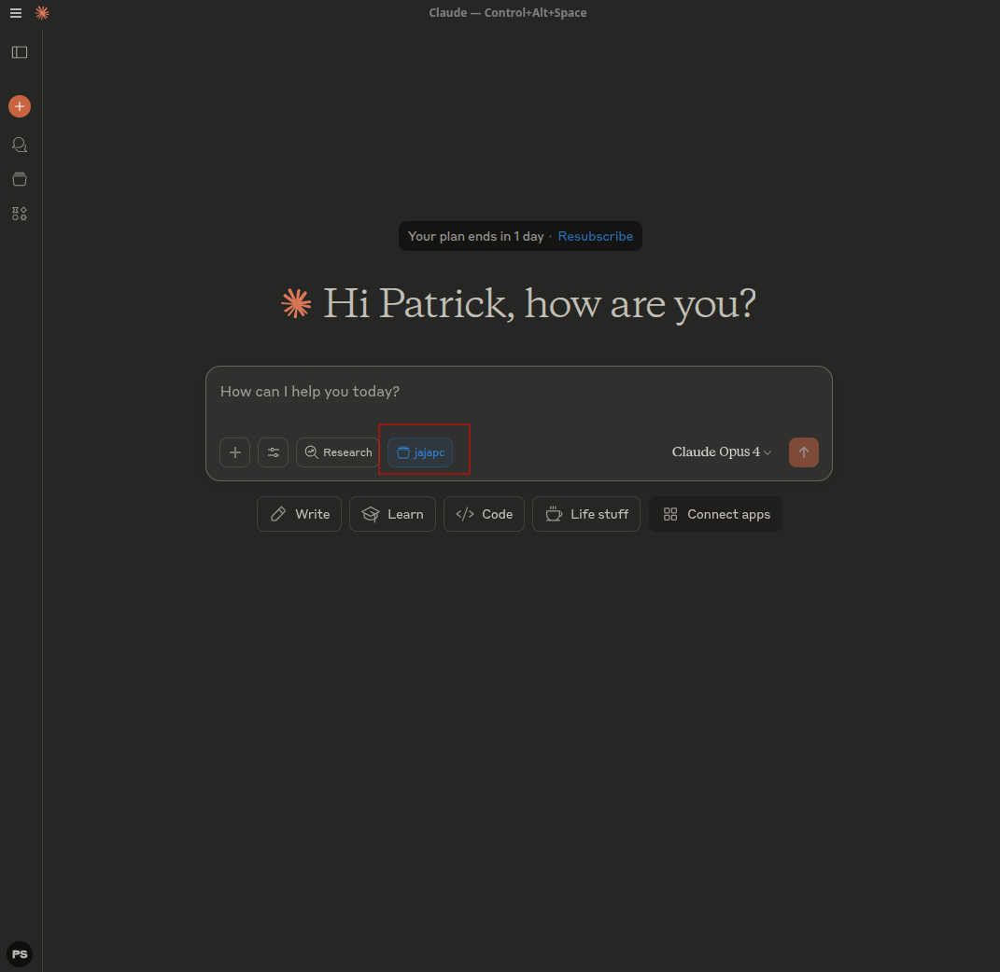

# Arch Context Generator

A Bash script that generates comprehensive system context documentation for Arch Linux systems, optimized for use with Claude.

> **Note for Arch Linux users**: Claude Desktop is now available for Arch Linux! See [claude-desktop-archlinux](https://github.com/patrickjaja/claude-desktop-archlinux) for installation.

## What does this script do?

`arch-context-generator.sh` collects detailed information about your Arch Linux system and creates a structured Markdown file with:

- Hardware information (CPU, RAM, disks, GPU)
- Operating system details and configuration
- Installed packages and services
- Network and audio configuration
- Development environment
- Security settings

## Why use this?

The generated context file significantly improves collaboration with Claude:
- **More precise help**: Claude can offer system-specific solutions
- **Fewer follow-up questions**: All relevant system information is immediately available
- **Better troubleshooting**: Claude knows your exact configuration

## Usage

### 1. Run the script

```bash
# Make the script executable
chmod +x arch-context-generator.sh

# Generate full context
./arch-context-generator.sh

# Basic context (only essential info)
./arch-context-generator.sh --basic

# Select specific modules
./arch-context-generator.sh --modules=hardware,packages,development
```

### 2. Find the generated file

The script creates:
- `arch-context_YYYY-MM-DD_HH-MM-SS.md` - Timestamped file
- `arch-context_latest.md` - Symbolic link to the latest version

### 3. Upload to Claude

1. Open [claude.ai](https://claude.ai)
2. Start a new conversation
3. Click the paperclip icon (📎)
4. Select the generated `arch-context_latest.md`
5. Ask your system-specific question



## Example use cases

- "Why isn't my audio service starting?"
- "Help me configure Docker on my system"
- "Optimize my BTRFS settings"
- "Why is my system slow to boot?"

With the uploaded context, Claude can directly address your specific system configuration and suggest appropriate solutions.

### Example: Claude helps with PipeWire audio issues


In this example, Claude recognizes from the system context that PipeWire is installed and provides specific commands for problem diagnosis.

## Privacy

The script:
- Filters sensitive data (passwords, emails, IPs)
- Stores everything locally
- Does not automatically transmit any data